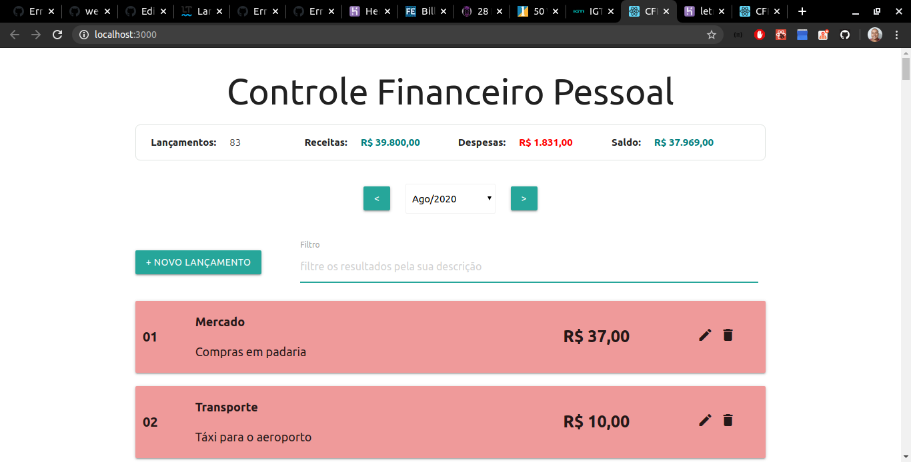
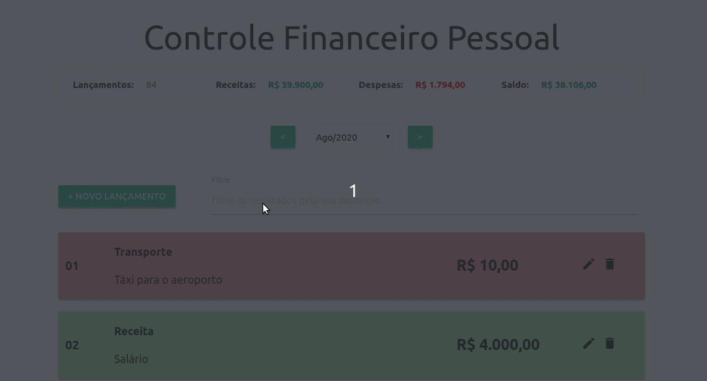
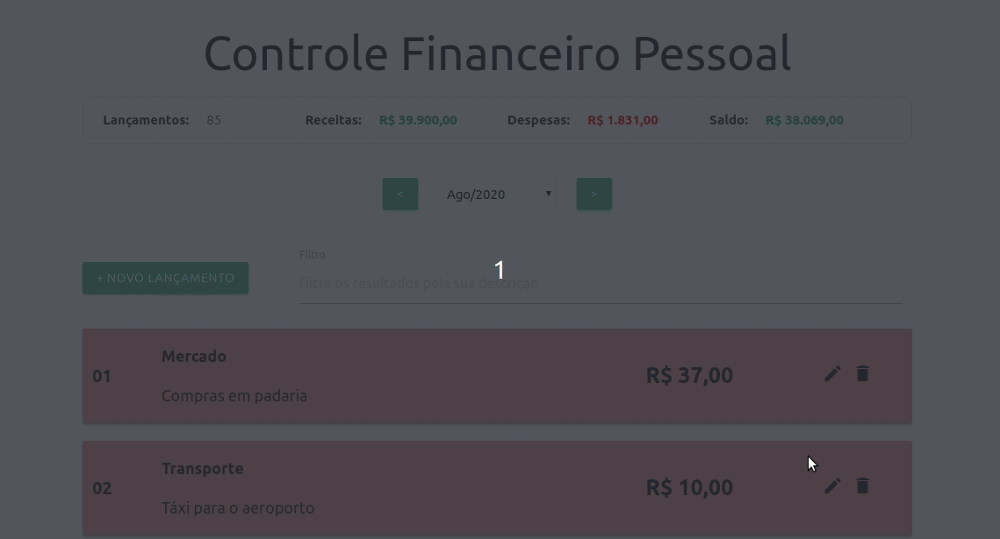
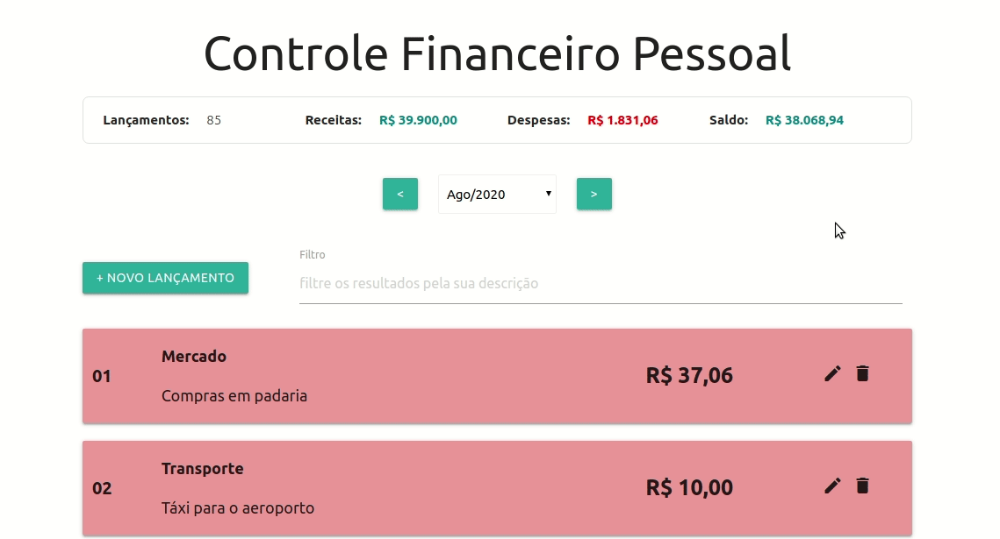

<!--
*** Thanks for checking out this README Template. If you have a suggestion that would
*** make this better, please fork the leTransactions-FullstackJs-app and create a pull request or simply open
*** an issue with the tag "enhancement".
*** Thanks again! Now go create something AMAZING! :D
***
***
***
*** To avoid retyping too much info. Do a search and replace for the following:
*** conradoalexsander, leTransactions-FullstackJs-app, twitter_handle, email
-->

<!-- PROJECT SHIELDS -->
<!--
*** I'm using markdown "reference style" links for readability.
*** Reference links are enclosed in brackets [ ] instead of parentheses ( ).
*** See the bottom of this document for the declaration of the reference variables
*** for contributors-url, forks-url, etc. This is an optional, concise syntax you may use.
*** https://www.markdownguide.org/basic-syntax/#reference-style-links
-->
[![Contributors][contributors-shield]][contributors-url]
[![Forks][forks-shield]][forks-url]
[![Stargazers][stars-shield]][stars-url]
[![Issues][issues-shield]][issues-url]
[![MIT License][license-shield]][license-url]
[![LinkedIn][linkedin-shield]][linkedin-url]


<!-- PROJECT LOGO -->
<br />
<p align="center">
  <a href="https://github.com/conradoalexsander/leTransactions-FullstackJs-app">
    
  </a>
s
  <h1 align="center">Le Transaction - Fullstack Js App</h1>

  <h2 align="center">
   Register your daily financial transactions !
  </h2>
    <br />
 
</p>

<!-- ABOUT THE PROJECT -->
## <h2 id="about-the-project"> :mortar_board: &nbsp; &nbsp; About The Project </h2>


“Rule No. 1: Never lose money. Rule No. 2: Never forget rule No.1” – Warren Buffett

Project developed during the Fullstack Js course, a developer bootcamp organized by <a href="https://www.igti.com.br/">IGTI</a> focused in Js - React.js, Node.js and MongoDB (local and Atlas).

<p align="center">

</p>


<!-- TABLE OF CONTENTS -->
## :bookmark: &nbsp; &nbsp; Table of Contents

* [About the Project](#about-the-project)
  * [Built With](#built-with)
* [Prerequisites](#prerequisites)
* [Installation](#installation)
* [Getting Started](#getting-started)
* [Usage](#usage)
* [Demo](#demo)
* [License](#license)
* [Contact](#contact)
* [Acknowledgements](#acknowledgements)

<!-- BUILT WITH -->
## <h2 id="built-with">:rocket: &nbsp; &nbsp; Built With</h2> 

### Frontend (Client)
* []() Js
* []() React.js
* []() Materialize CSS
* []() React Modals

### Backend (Server)
* []() Js
* []() Node.js
* []() Express
* []() CORS
* []() Mongoose

### Database
* []() MongoDB Atlas

### Deploy
* []() .Heroku


## <h3 id="prerequisites"> :pushpin: &nbsp; &nbsp; Prerequisites </h2>

* []() Node.js (12.17+)
* []() Yarn or NPM
* []() A DB hosted in MongoDB Atlas 

Obs.: With some adjustments, this application can  be run locally.

## <h3 id="installation"> :computer: &nbsp; &nbsp; Installation </h2>
 
1. Clone the leTransactions FullstackJsapp
```sh
git clone https://github.com/conradoalexsander/leTransactions-FullstackJs-app.git
```

2. In the root folder, create a .env file with the DB_CONNECTION environment variable:
```sh
DB_CONNECTION="YOU_DB_CONNECTION"
```

3. In the client folder (root > client), create a .env file with the SKIP_PREFLIGHT_CHECK environment variable:
```sh
SKIP_PREFLIGHT_CHECK=true
```

<!-- GETTING STARTED -->
## <h2 id="getting-started">:fire: &nbsp; &nbsp; Getting Started </h2>

Before following the next steps, make sure to have the prerequisites installed and configurated. 

1. Open a terminal in the root folder and run following command:
```sh
yarn start
```

2. Open a terminal in the client folder (root > client) and run following command:
```sh
yarn start
```

The application will launch in your default browser.


<!-- USAGE -->
## <h2 id="usage"> :sparkles: &nbsp; &nbsp; Usage </h2>


  <p align="center">
  You can select the month/year you want to query through arrows buttons or the dropdown list.
  <br/>
  
  <br/>
  </p>
  
  <p align="center">
  To filter your results, use the input field
  <br/>
  
  <br/>
  </p>
  
  <p align="center">
  It is possible to add a new transaction trhough the "+ Novo Lançamento" (+ New Transaction) button.
  <br/>
  
  <br/>
  </p>
  
  <p align="center">
  Maybe you will want to update a transaction with new info, to do this, just click in the Edit icon. Howerver, you can't change its type (it would be veeery strage, don't you think? :laughing:):
  <br />
  
  <br>
  </p>
  
  <p align="center">
  Finally, to delete a transaction, just click in the trash icon:
   <br />
  
  <br />
  </p>
  


<!-- DEMO -->
## <h2 id="demo"> :tv: &nbsp; &nbsp; Demo </h2>

A demo of the project was deployed in heroku, you can check it here:
| Platform | Service | Link |
| :--- | :--- | :--- |
| Heroku | Client | [https://letransactions-desafio-final.herokuapp.com](https://letransactions-desafio-final.herokuapp.com)|

*Obs.: Currently, this app only supports desktop usage. Using it in small screens may lead to incorrect visuals and behavior.

<!-- LICENSE -->
## <h2 id="license"> :scroll: &nbsp; &nbsp; License </h2>

Distributed under the MIT License.

<!-- CONTACT -->
## <h2 id="contact"> :telephone_receiver: &nbsp; &nbsp; Contact </h2>

Conrado Alexsander </br>
Github: [https://github.com/conradoalexsander](https://github.com/conradoalexsander) </br>
Project Link: [https://github.com/conradoalexsander/leTransactions-FullstackJs-app](https://github.com/conradoalexsander/leTransactions-FullstackJs-app)


<!-- ACKNOWLEDGEMENTS -->
## <h2 id="acknowledgements"> :thumbsup: &nbsp; &nbsp; Acknowledgements </h2>

* []() <a href="https://www.igti.com.br/">IGTI Team</a>

<!-- MARKDOWN LINKS & IMAGES -->
<!-- https://www.markdownguide.org/basic-syntax/#reference-style-links -->
[contributors-shield]: https://img.shields.io/github/contributors/conradoalexsander/leTransactions-FullstackJs-app.svg?style=flat-square
[contributors-url]: https://github.com/conradoalexsander/leTransactions-FullstackJs-app/graphs/contributors

[forks-shield]:  https://img.shields.io/github/forks/conradoalexsander/leTransactions-FullstackJs-app.svg?style=flat-square

[forks-url]: https://github.com/conradoalexsander/leTransactions-FullstackJs-app/network/members

[stars-shield]: https://img.shields.io/github/stars/conradoalexsander/leTransactions-FullstackJs-app.svg?style=flat-square
[stars-url]: https://github.com/conradoalexsander/leTransactions-FullstackJs-app/stargazers
[issues-shield]: https://img.shields.io/github/issues/conradoalexsander/leTransactions-FullstackJs-app.svg?style=flat-square
[issues-url]: https://github.com/conradoalexsander/leTransactions-FullstackJs-app/issues
[license-shield]: https://img.shields.io/github/license/conradoalexsander/leTransactions-FullstackJs-app.svg?style=flat-square
[license-url]: https://github.com/conradoalexsander/leTransactions-FullstackJs-app/blob/master/LICENSE.txt
[linkedin-shield]: https://img.shields.io/badge/-LinkedIn-black.svg?style=flat-square&logo=linkedin&colorB=555
[linkedin-url]: https://www.linkedin.com/in/conrado-alexsander
[product-screenshot]: images/screenshot.png
